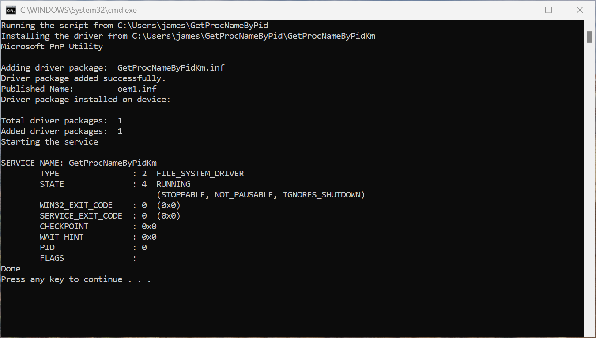
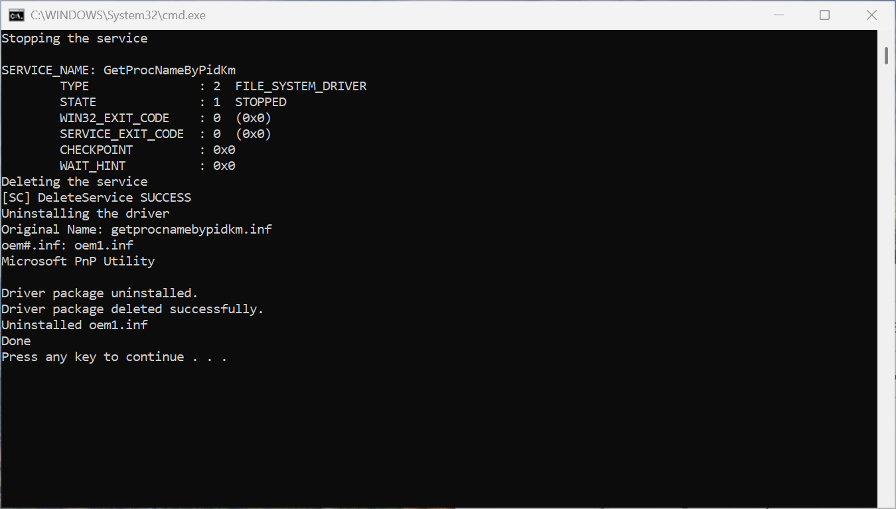
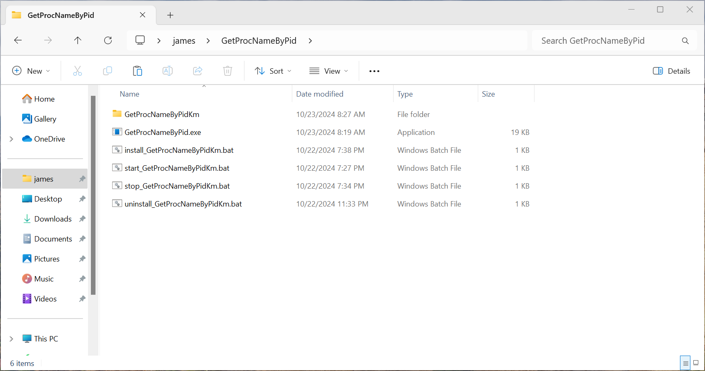
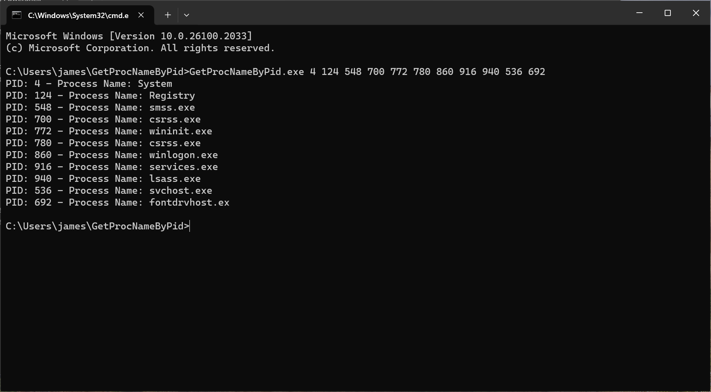
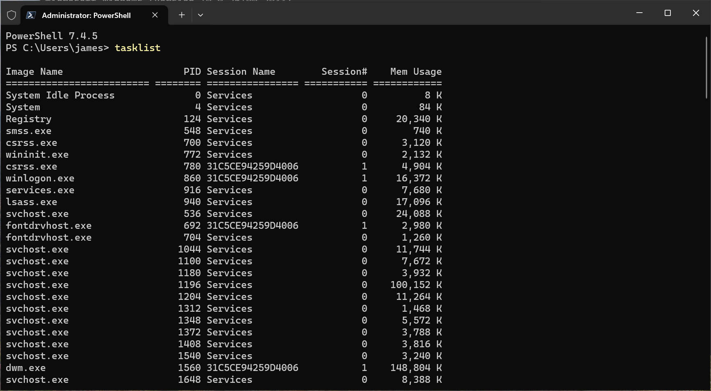
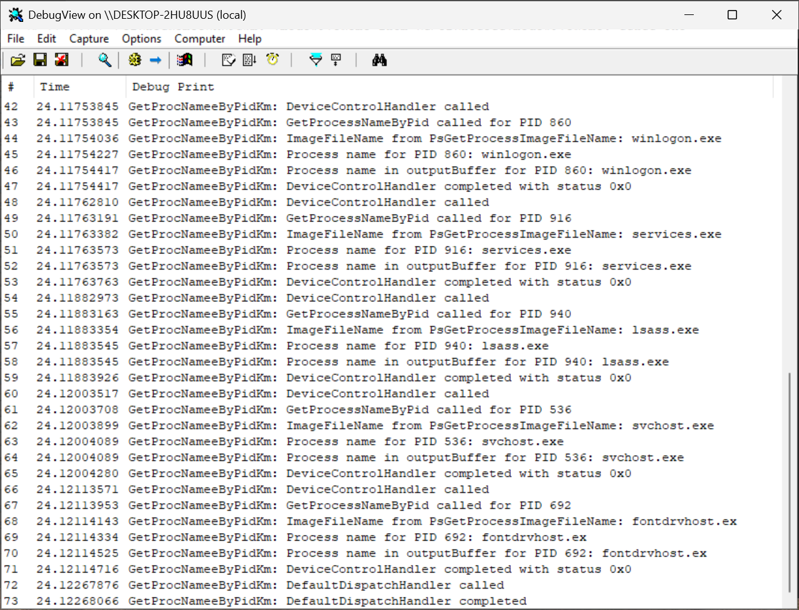
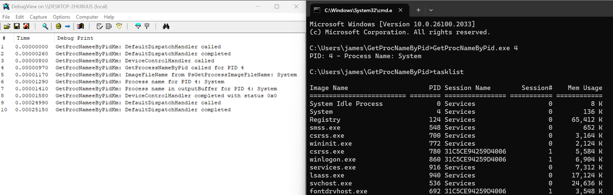
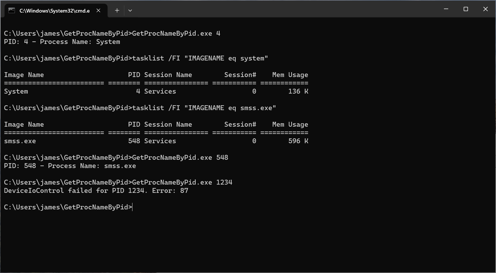
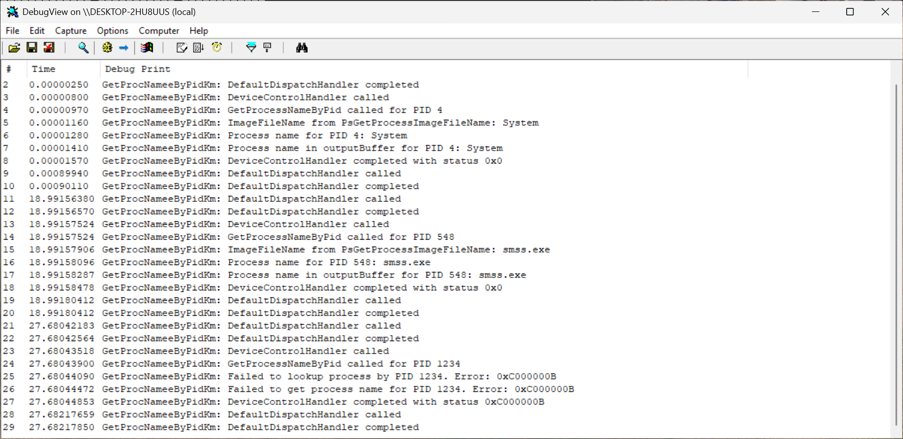

# GetProcNameByPid

## Overview

This project consists of two main components: `GetProcNameByPid` and `GetProcNameByPidKm`. The `GetProcNameByPid` component is a user-mode application, while `GetProcNameByPidKm` is a kernel-mode driver.

This is a simple example of using the `DeviceIoControl` function with the Neither I/O method.

## Building the Project

### Prerequisites

- Visual Studio 2022 with C++ development tools
- Windows Driver Kit (WDK) for kernel-mode driver development

### Steps

1. Open the solution file [GetProcNameByPid.sln](GetProcNameByPid.sln) in Visual Studio 2022.

2. Build the `GetProcNameByPid` project:
   - Build the project for the desired configuration (Debug/Release).

3. Build the `GetProcNameByPidKm` project:
   - Build the project for the desired configuration (Debug/Release).

4. Or just `Build Solution`.

## Running the Project

### User-Mode Application

- The built executable `GetProcNameByPid.exe` can be found in the `x64/Debug` or `x64/Release` directory.

### Kernel-Mode Driver

- The built driver `GetProcNameByPidKm.sys` can be found in the `x64/Debug` or `x64/Release` directory of the `GetProcNameByPidKm` folder.

### Installation and Management Scripts

**Note:** The following scripts require administrator privileges to run.

- To install the kernel-mode driver, use [install_GetProcNameByPidKm.bat](install_GetProcNameByPidKm.bat).
- To start the driver, use [start_GetProcNameByPidKm.bat](start_GetProcNameByPidKm.bat).
- To stop the driver, use [stop_GetProcNameByPidKm.bat](stop_GetProcNameByPidKm.bat).
- To uninstall the driver, use [uninstall_GetProcNameByPidKm.bat](uninstall_GetProcNameByPidKm.bat).

To run these scripts as an administrator, right-click the `.bat` file and select "Run as administrator".

<p align="center">
    
</p>

<p align="center">
    
</p>

## Deployment to Target Computer (VM)

### Steps

1. Copy the following files and folders to the target computer (VM):
   - `GetProcNameByPidKm` folder (containing `.sys`, `.inf`, `.cat` files)
   - `GetProcNameByPid.exe`
   - `install_GetProcNameByPidKm.bat`
   - `start_GetProcNameByPidKm.bat`
   - `stop_GetProcNameByPidKm.bat`
   - `uninstall_GetProcNameByPidKm.bat`

<p align="center">
    
</p>

2. Enable Debug Mode and Test Signing Mode on the target computer (VM):
   - Open Command Prompt as Administrator.
   - Run the following command to enable test signing mode:
     ```
     bcdedit /debug on
     bcdedit /set testsigning on
     ```
   - Restart the computer to apply the changes.

3. After the computer restarts, you can use the provided `.bat` scripts to manage the kernel-mode driver.

4. Open a command prompt and navigate to the folder where `GetProcNameByPid.exe` is located.

5. Usage:
   - Run `GetProcNameByPid.exe` at command prompt:
     ```
     GetProcNameByPid.exe <pid1> <pid2> ... <pidN>
     ```
   - For example:
     ```
     GetProcNameByPid.exe 4 124 548 700 772 780 860 916 940 536 692
     ```

<p align="center">
    
</p>

<p align="center">
    
</p>

<p align="center">
    
</p>

## Orther Examples

<p align="center">
    
</p>

<p align="center">
    
</p>

<p align="center">
    
</p>